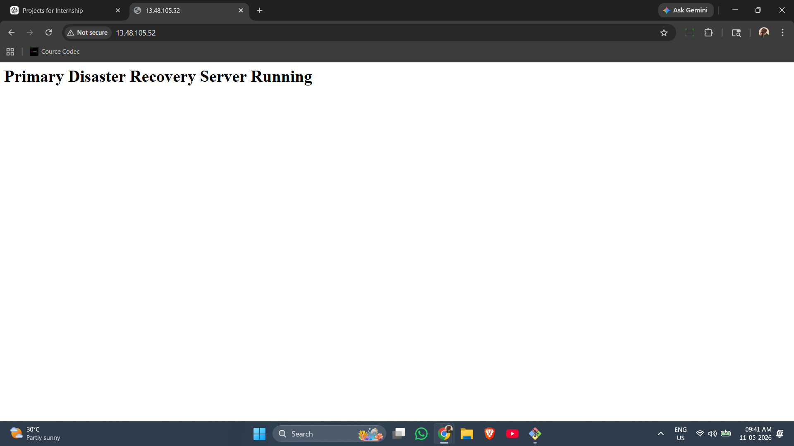
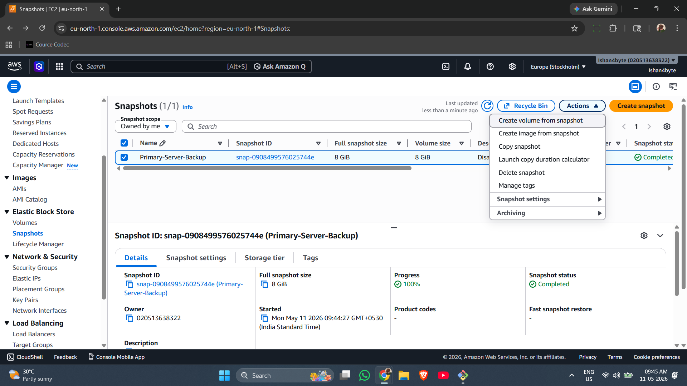
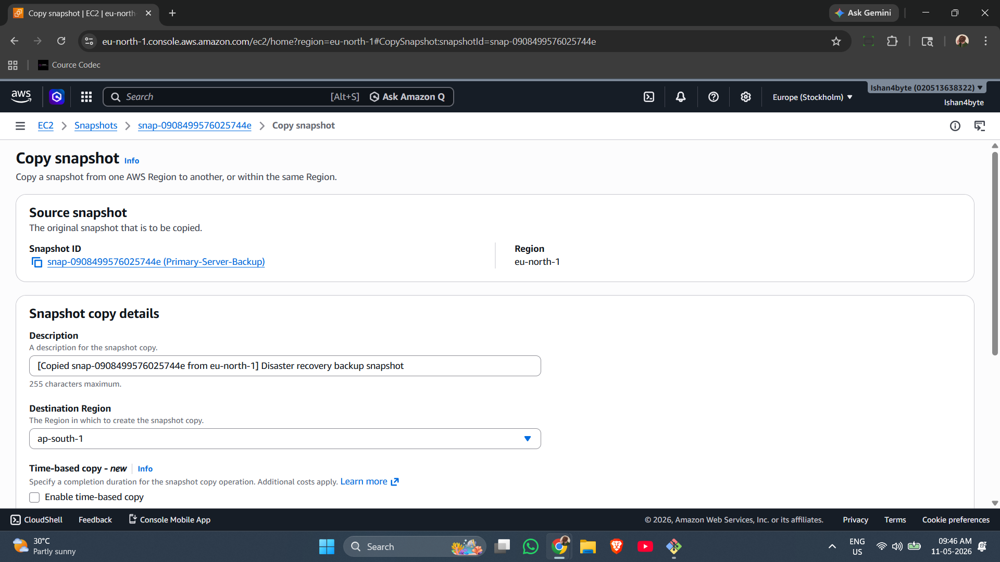
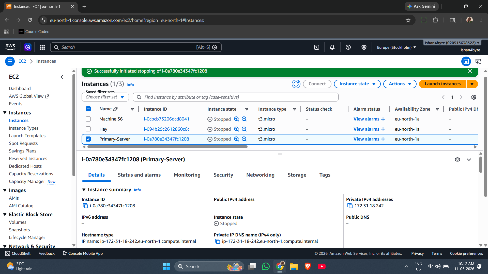
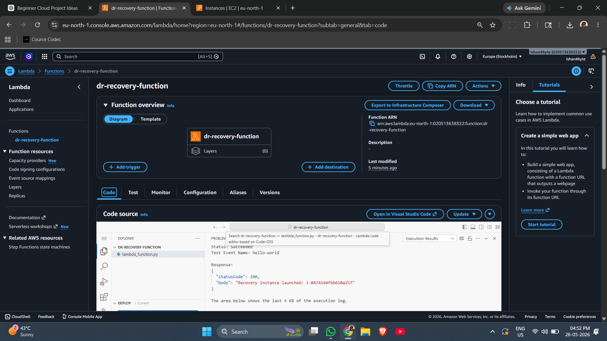
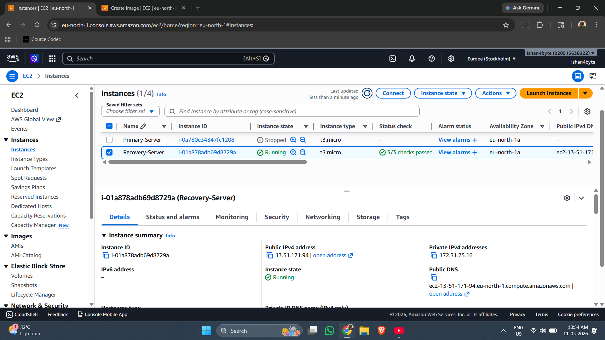
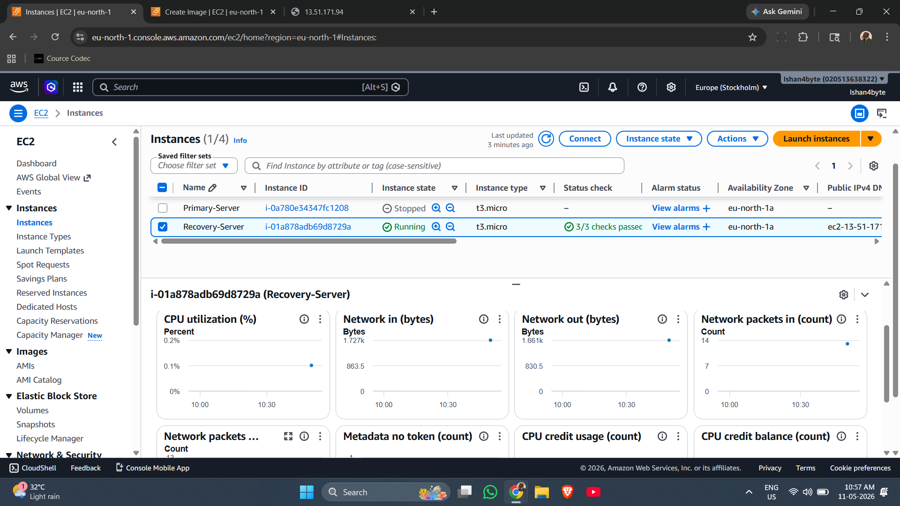
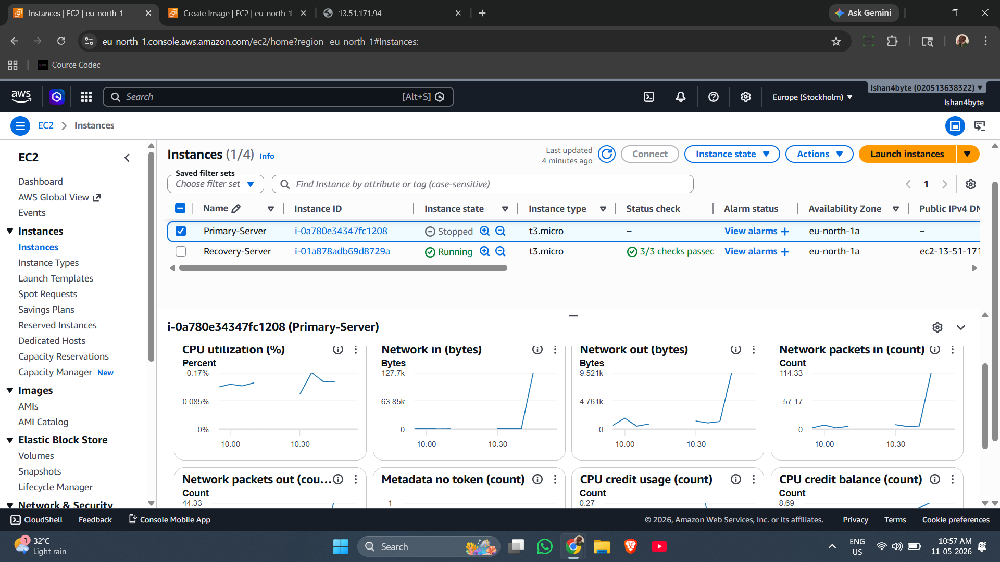

# Automated Cloud Disaster Recovery System

An automated disaster recovery system built on AWS using EC2, AMI backups, CloudWatch monitoring, and Lambda-based recovery orchestration.

---

# Project Overview

This project demonstrates how cloud infrastructure can automatically recover from server failures using AWS services.

The system continuously monitors a primary EC2 server. If the primary server fails, AWS Lambda automatically launches a recovery server from a backup AMI.

This project simulates real-world disaster recovery and self-healing cloud infrastructure workflows.

---

# Technologies Used

- AWS EC2
- AWS Lambda
- AWS CloudWatch
- Amazon Machine Images (AMI)
- EBS Snapshots
- Python
- Boto3 SDK
- Ubuntu Server
- Apache Web Server

---

# Architecture

## Disaster Recovery Workflow

```text
Primary EC2 Server
        ↓
CloudWatch Monitoring
        ↓
Failure Detection
        ↓
AWS Lambda Trigger
        ↓
Launch Recovery EC2 from Backup AMI
        ↓
Recovered Web Server
```

---

# Features

- Automated EC2 recovery
- CloudWatch-based failure monitoring
- Lambda recovery orchestration
- AMI-based infrastructure restoration
- Cross-region disaster recovery support
- Self-healing infrastructure simulation

---

# Project Workflow

## 1. Primary Server Deployment

Ubuntu EC2 instance deployed with Apache web server.



---

## 2. Backup Snapshot Creation

EBS snapshot and AMI backup created for disaster recovery.



---

## 3. Cross-Region Backup Replication

Backup copied to another AWS region for geographic redundancy.



---

## 4. Disaster Simulation

Primary server intentionally stopped to simulate infrastructure failure.



---

## 5. Lambda Recovery Automation

AWS Lambda function automatically triggered recovery workflow.



---

## 6. Recovery Server Provisioning

Recovery EC2 instance launched automatically from backup AMI.



---

## 7. Recovery Infrastructure Running

Recovery server became operational after automated failover.



---

## 8. Successful Disaster Recovery

Recovered web application became accessible successfully.



---

# Lambda Recovery Script

Location:

```bash
lambda/lambda_function.py
```

The Lambda function automatically launches a recovery EC2 instance using a backup AMI.

---

# Recovery Metrics

| Metric | Value |
|---|---|
| Recovery Type | Automated |
| Monitoring Service | AWS CloudWatch |
| Recovery Engine | AWS Lambda |
| Backup Method | AMI + EBS Snapshot |
| Recovery Objective | Minimal Downtime |
| Infrastructure | Self-Healing |

---

# Learning Outcomes

This project demonstrates:

- Cloud disaster recovery
- Infrastructure automation
- AWS monitoring workflows
- Event-driven recovery systems
- Self-healing cloud architecture
- Infrastructure resiliency

---

# Future Improvements

- Route53 DNS failover
- Elastic IP reassignment
- Multi-region automated recovery
- Auto Scaling integration
- RDS automated recovery
- Email/SNS alerting
- Infrastructure as Code (Terraform)

---

# Author

Ishan Gupta
