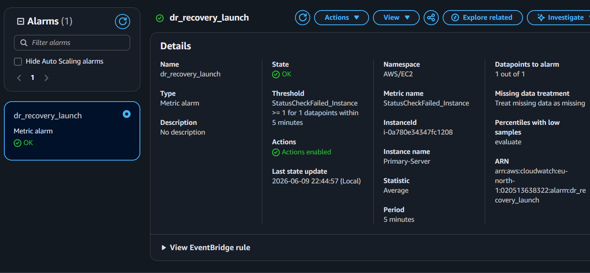
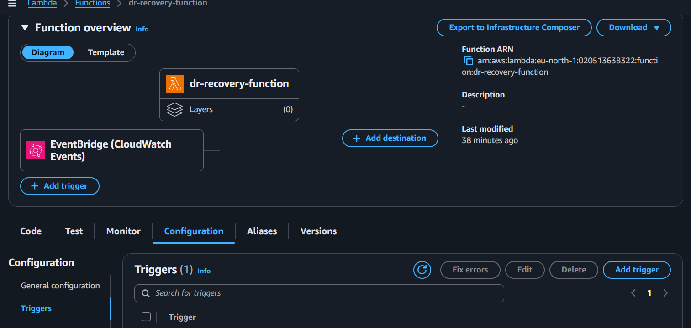
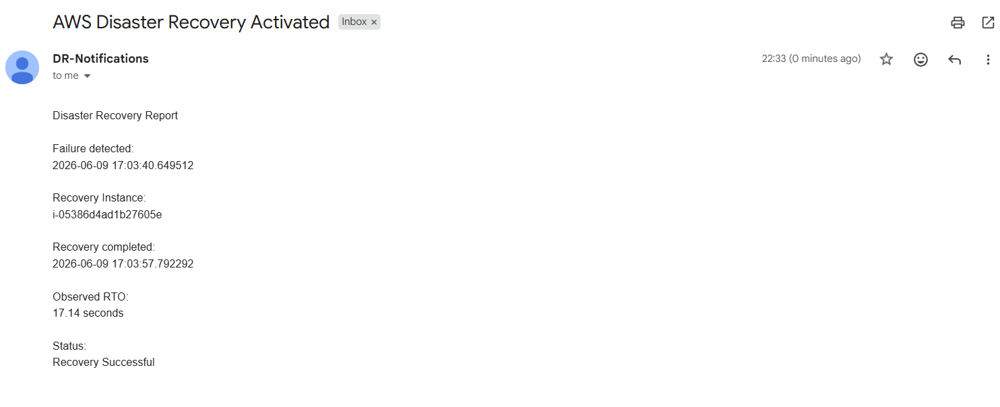

# Automated Cloud Disaster Recovery System

An automated disaster recovery solution built on AWS that detects infrastructure failures, launches replacement servers from backup images, sends recovery notifications, and measures Recovery Time Objective (RTO) using serverless automation.

---

# Project Overview

This project demonstrates how cloud infrastructure can automatically recover from failures using AWS services.

The system continuously monitors a primary EC2 server using Amazon CloudWatch alarms. AWS EventBridge was also configured to respond to EC2 state-change events. When a failure is detected, AWS Lambda automatically provisions a replacement EC2 instance from a backup Amazon Machine Image (AMI), sends Amazon SNS notifications to administrators, and calculates the observed Recovery Time Objective (RTO).

The project simulates self-healing cloud infrastructure and real-world disaster recovery workflows.

---

# Technologies Used

* AWS EC2
* AWS Lambda
* Amazon CloudWatch
* Amazon EventBridge
* Amazon SNS
* Amazon Machine Images (AMI)
* EBS Snapshots
* Python
* Boto3 SDK
* Ubuntu Server
* Apache Web Server

---

# Architecture

## Disaster Recovery Workflow

```text
Health-Based Recovery

Primary EC2 Server
        ↓
CloudWatch Alarm
        ↓
AWS Lambda
        ↓
Launch Recovery EC2
        ↓
SNS Notification
        ↓
Recovered Web Server


State-Change Recovery

Primary EC2 Server
        ↓
EventBridge Rule
        ↓
AWS Lambda
        ↓
Launch Recovery EC2
        ↓
SNS Notification
        ↓
Recovered Web Server
```

---

# Features

* Automated EC2 recovery
* CloudWatch health monitoring
* EventBridge state-change recovery
* Lambda recovery orchestration
* SNS email notifications
* Automated Recovery Time Objective (RTO) reporting
* AMI-based infrastructure restoration
* Cross-region AMI backup support
* Self-healing infrastructure simulation

---

# Project Workflow

## 1. Primary Server Deployment

Ubuntu EC2 instance deployed with Apache web server.


---

## 2. Backup Snapshot Creation

EBS snapshot and AMI backup created for disaster recovery.


---

## 3. Cross-Region Backup Replication

The backup AMI was copied to another AWS region to improve disaster recovery readiness.


---

## 4. Disaster Simulation

The primary server was intentionally stopped to validate automated recovery.


---

## 5. CloudWatch Health Monitoring

Amazon CloudWatch continuously monitored the primary server using EC2 status checks.



---

## 6. EventBridge Recovery Trigger

EventBridge was configured to invoke Lambda when EC2 state-change events occurred.



---

## 7. Lambda Recovery Automation

AWS Lambda executed the disaster recovery workflow and initiated server restoration.


---

## 8. Recovery Server Provisioning

A replacement EC2 instance was automatically launched from the backup AMI.


---

## 9. Recovery Infrastructure Running

The recovery instance successfully entered the running state.


---

## 10. Successful Disaster Recovery

The recovered web application became accessible without manual intervention.


---

## 11. SNS Notification and RTO Report

Amazon SNS delivered recovery notifications containing recovery details and the observed RTO.



---

# Lambda Recovery Script

Location:

```bash
lambda/dr_recovery_lambda.py
```

The Lambda function performs the following actions:

1. Records the failure detection timestamp.
2. Launches a recovery EC2 instance using a backup AMI.
3. Waits for the replacement instance to enter the running state.
4. Calculates the observed Recovery Time Objective (RTO).
5. Sends an SNS notification containing recovery details.
6. Stores execution logs in CloudWatch Logs.

---

# Recovery Time Objective (RTO)

Recovery Time Objective (RTO) represents the amount of time required to restore service after a failure has been detected.

The Lambda workflow automatically calculates RTO using:

```text
RTO = Recovery Completion Time − Failure Detection Time
```

The following values are recorded:

* Failure detection timestamp
* Recovery completion timestamp
* Recovery instance identifier
* Recovery region
* Recovery status

### Observed RTO During Testing

> **17.14 seconds**

**Note:** The observed value represents infrastructure recovery time measured until the EC2 instance entered the running state. Actual application availability may vary depending on service initialization time.

---

# Recovery Metrics

| Metric               | Value              |
| -------------------- | ------------------ |
| Recovery Type        | Automated          |
| Health Monitoring    | Amazon CloudWatch  |
| State Monitoring     | Amazon EventBridge |
| Recovery Engine      | AWS Lambda         |
| Notification Service | Amazon SNS         |
| Backup Method        | AMI + EBS Snapshot |
| Cross-Region Support | Enabled            |
| RTO Measurement      | Automated          |
| Infrastructure       | Self-Healing       |

---

# Setup Guide

## AWS Services Used

* Amazon EC2
* AWS Lambda
* Amazon CloudWatch
* Amazon EventBridge
* Amazon SNS
* Amazon Machine Images (AMI)
* EBS Snapshots

## Deployment Steps

1. Launch the primary EC2 instance hosting the web application.
2. Create an EBS snapshot and AMI backup.
3. Replicate the AMI to a secondary AWS region.
4. Configure CloudWatch alarms for health-based monitoring.
5. Configure EventBridge rules for EC2 state-change recovery.
6. Deploy the Lambda recovery function.
7. Configure SNS email notifications.
8. Simulate failure scenarios and validate automated recovery.
9. Verify RTO measurements using SNS notifications and CloudWatch logs.

---

# Learning Outcomes

* Cloud disaster recovery planning
* Infrastructure automation using AWS Lambda
* Amazon CloudWatch monitoring workflows
* EventBridge event-driven recovery
* Recovery Time Objective (RTO) evaluation
* Amazon SNS operational notifications
* Cross-region backup strategies
* Self-healing cloud architecture
* Infrastructure resiliency principles

---

# Future Improvements

* Route53 DNS failover
* Elastic IP reassignment
* Fully automated multi-region failover
* RDS automated recovery
* Infrastructure as Code using Terraform or CloudFormation

---

# Author

**Ishan Gupta**

B.Tech Computer Science Engineering
(Cloud Technology & Information Security)

GitHub: https://github.com/ishan12byte

LinkedIn: https://linkedin.com/in/ishan-gupta-620822322
